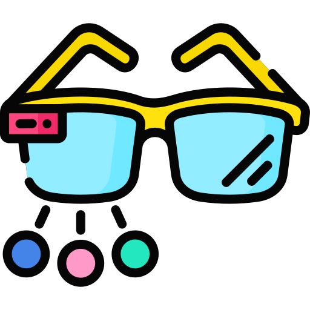
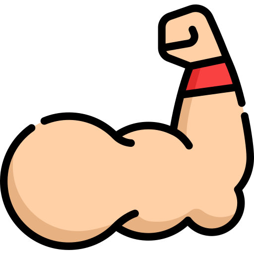
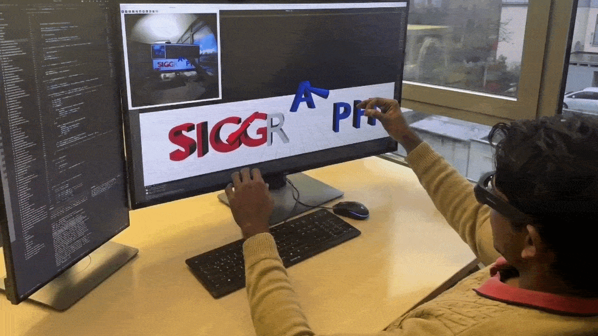
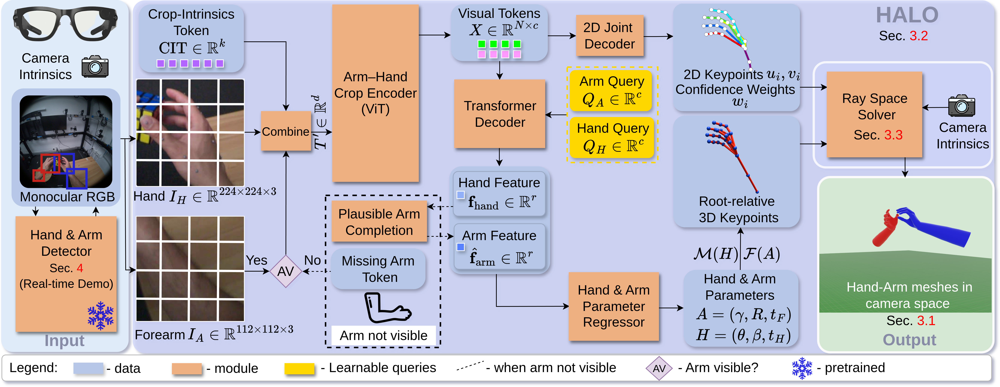

<h1 align="center">
  
  EgoForce
  
</h1>

<h2 align="center">
  <strong>Forearm-Guided Camera-Space 3D Hand Pose from a Monocular Egocentric Camera</strong>
</h2>

<p align="center">
  Christen Millerdurai<sup>1</sup>,
  Shaoxiang Wang<sup>1,2</sup>,
  Yaxu Xie<sup>1</sup>,
  Vladislav Golyanik<sup>3</sup>,
  Didier Stricker<sup>1,2</sup>,
  Alain Pagani<sup>1</sup>
</p>

<p align="center">
  <sup>1</sup>German Research Center for Artificial Intelligence (DFKI)
  &nbsp;|&nbsp;
  <sup>2</sup>Rhineland-Palatinate Technical University of Kaiserslautern-Landau (RPTU)
  &nbsp;|&nbsp;
  <sup>3</sup>Max Planck Institute for Informatics (MPII)
</p>

<p align="center">
  <strong><a href="https://www.siggraph.org/">ACM SIGGRAPH Conference Proceedings, 2026</a></strong>
</p>

<p align="center">
  <a href="">arXiv</a>
  &nbsp;|&nbsp;
  <a href="https://github.com/dfki-av/EgoForce/tree/main">Code</a>
  &nbsp;|&nbsp;
  <a href="https://huggingface.co/datasets/chris10/EgoForce">Data</a>
  &nbsp;|&nbsp;
  <a href="https://huggingface.co/spaces/chris10/EgoForce">Demo</a>
</p>

## Official PyTorch implementation

<p align="center">
</br>
</p>


### Abstract

Reconstructing the absolute 3D pose and shape of the hands from the user’s viewpoint using a single head-mounted camera is crucial for practical egocen- tric interaction in AR/VR, telepresence, and hand-centric manipulation tasks, where sensing must remain compact and unobtrusive. While monocular RGB methods have made progress, they remain constrained by depth–scale am- biguity and struggle to generalize across the diverse optical configurations of head-mounted devices. As a result, models typically require extensive training on device-specific datasets, which are costly and laborious to ac- quire. This paper addresses these challenges by introducing EgoForce , a monocular 3D hand reconstruction framework that recovers robust, absolute 3D hand pose and its position from the user’s (camera-space) viewpoint. EgoForce operates across fisheye, perspective, and distorted wide-FOV camera models using a single unified network. Our approach combines a differentiable forearm representation that stabilizes hand pose, a unified arm–hand transformer that predicts both hand and forearm geometry from a single egocentric view, mitigating depth–scale ambiguity, and a ray space closed-form solver that enables absolute 3D pose recovery across diverse head-mounted camera models. Experiments on three egocentric benchmarks show that EgoForce achieves state-of-the-art 3D accuracy, reducing camera- space MPJPE by up to 28% on the HOT3D dataset compared to prior methods and maintaining consistent performance across camera configurations.


### EgoForce

<p align="center">
  
</p>


<p align="center">
EgoForce processes a monocular egocentric RGB frame by extracting hand and forearm crops, tokenizing them, and conditioning the features on crop intrinsics (CIT). A transformer jointly infers hand–arm features to predict 2D keypoints (with confidences) and root-relative 3D hand and arm poses, which are lifted to camera-space meshes via the ray space solver. When the forearm is out of view, arm tokens are replaced with missing-arm tokens, and a hand-conditioned variational prior infers a plausible arm representation. We apply this workflow independently to the left and right hand-forearm crops.
</p>


## Usage


### Installation

#### 1. Create the environment

The install script targets a Conda environment named `egoforce` and installs the CUDA 12.6, PyTorch 2.8, TensorRT, MMCV, AnyCalib, PyTorch3D, and Project Aria dependencies used by the repo.

```bash
conda create -n egoforce python=3.10 -y
conda activate egoforce
bash scripts/install.sh
```

#### 2. Download model weights

The model weights, detector checkpoints, MANO files, and demo assets expected by `settings.py` live under the repo-local `_DATA/` directory.

```bash
bash scripts/download_model_weights.sh
```

By default, the main checkpoint path is [settings.py](settings.py#L28):

```python
config.POSE_3D.CHECKPOINT_PATH = os.path.join(_DATA_DIR, 'model_weights.pth')
```

#### 3. Download datasets

The dataset downloader clones the Hugging Face dataset repo with git-lfs and writes it to:

```text
<data-root>/EgoForce
```

You must pass the destination explicitly:

```bash
bash scripts/download_datasets.sh --data-root /path/to/datasets
```

After download, update [settings.py](settings.py#L12) so `config.DATASET.DIR` points to your dataset root with a trailing slash, for example:

```python
config.DATASET.DIR = "/path/to/datasets/"
```

The repo then resolves the dataset folders as:

- `EgoForce/HOT3D`
- `EgoForce/ARCTIC`
- `EgoForce/H2O`

#### 4. Verify the key paths

Before running experiments, make sure these paths exist:

- Data root: `_DATA/`
- datasets root: `config.DATASET.DIR + "EgoForce/..."`

### Evaluation

#### 1. Save predictions

The main entrypoint is [experiments/save_predictions.py](experiments/save_predictions.py). It runs EgoForce on a dataset split and saves a pickle file under `_DATA/predictions/`.

Supported datasets are:

- `ARCTIC`
- `H2O`
- `HO3D`
- `HOT3D`
- `HOT3D_PINHOLE`
- `HOT3D_EQUISOLID`
- `HOT3D_EQUIRECTANGULAR`
- `HOT3D_STEREOGRAPHIC`

Example:

```bash
python experiments/save_predictions.py \
  --test-dataset-name ARCTIC \
  --checkpoint-path _DATA/model_weights.pth
```

Common ablation and variant flags:

- `--no-undistort-inp`
- `--no-cit`
- `--no-arm-prior`
- `--no-arm-input`
- `--anycalib-624`
- `--anycalib-pin`
- `--depth-model`
- `--dgp-model`

Prediction files are written as:

```text
_DATA/predictions/<DATASET>_<suffix>_predictions.pkl
```

#### 2. Evaluate saved predictions

[experiments/evaluate_predictions.py](experiments/evaluate_predictions.py) reads the saved prediction PKLs, applies the matching suffix logic, and writes evaluation summaries under `results/OURS/`.

Example:

```bash
python experiments/evaluate_predictions.py \
  --test-dataset-name ARCTIC
```

If you evaluated a specific variant, pass the same flags used during prediction generation so the script resolves the correct suffix:

```bash
python experiments/evaluate_predictions.py \
  --test-dataset-name HOT3D \
  --no-cit
```

Useful options:

- `--disable-kalman-filter` disables translation smoothing. Kalman filtering is enabled by default.
- `--results-root <dir>` changes the output root from `results/`.

#### 3. Intrinsics robustness on HOT3D

[experiments/save_noisy_intrinsic_predictions.py](experiments/save_noisy_intrinsic_predictions.py) runs a HOT3D-only camera-noise sweep. It first estimates first-frame AnyCalib intrinsics, then evaluates multiple intrinsic noise levels and stores both prediction caches and camera-noise analysis artifacts.

```bash
python experiments/save_noisy_intrinsic_predictions.py
```

Optional controls:

- `--no-cit`
- `--ray-grid-size`
- `--radial-bins`
- `--force-recompute`
- `--noisy-predictions-dir <dir>`

This script writes noisy prediction PKLs, camera-noise analysis PKLs, AnyCalib intrinsics JSON files, and plots under `_DATA/noisy_predictions/`.

To aggregate the robustness results, run [experiments/evaluate_noisy_intrinsic_predictions.py](experiments/evaluate_noisy_intrinsic_predictions.py):

```bash
python experiments/evaluate_noisy_intrinsic_predictions.py
```

The default output directory is:

```text
results/intrinsics_robustness
```

#### 4. Hand-scale analysis

[experiments/evaluate_hand_scale.py](experiments/evaluate_hand_scale.py) evaluates hand-scale consistency and calibration behavior from prediction PKLs. It can auto-discover predictions under `_DATA/predictions/` by suffix, or you can pass files explicitly.

Auto-discovery example:

```bash
python experiments/evaluate_hand_scale.py --suffix undistort_inp_true
```

Explicit-file example:

```bash
python experiments/evaluate_hand_scale.py \
  --hot3d-predictions _DATA/predictions/HOT3D_undistort_inp_true_predictions.pkl \
  --arctic-predictions _DATA/predictions/ARCTIC_undistort_inp_true_predictions.pkl
```

By default, the script writes CSV summaries, plots, and a text report to:

```text
results/hand_scale_eval/<suffix>/
```

#### 5. Visibility-bin forearm ablation

[experiments/hand_joint_occlusion_graph.py](experiments/hand_joint_occlusion_graph.py) compares ARCTIC predictions with and without forearm input, grouped by hand-joint visibility.

It expects these two prediction files to exist in `_DATA/predictions/`:

- `ARCTIC_undistort_inp_true_predictions.pkl`
- `ARCTIC_undistort_inp_true_no_arm_input_predictions.pkl`

Run:

```bash
python experiments/hand_joint_occlusion_graph.py
```

Artifacts are written under:

```text
results/hand_joint_occlusion_graph/
```

## Demo 

### Gradio video demo

The Gradio app in [demo/run_app.py](demo/run_app.py) runs EgoForce on uploaded videos and shows the output video with the input view, ego-view render, and third-person render.

Start it with:

```bash
python demo/run_app.py
```

Useful launch options:

```bash
python demo/run_app.py --server-name 0.0.0.0 --server-port 7860
python demo/run_app.py --share
```

### Project Aria live demo

The live Aria demo in [demo/run_aria.py](demo/run_aria.py) streams RGB frames from a Project Aria device over USB and runs inference frame by frame.

Run:

```bash
python demo/run_aria.py
```

Notes:

- the streaming config in `run_aria.py` uses USB and ephemeral certificates
- Check [project aria documentation](https://facebookresearch.github.io/projectaria_tools/docs/ARK/sdk/samples/streaming_subscribe) for more details on device setup.

## Citation

If you find this code useful for your research, please cite our paper:
```
@inproceedings{millerdurai2026egoforce,
      title={EgoForce: Forearm-Guided Camera-Space 3D Hand Pose from a Monocular Egocentric Camera},
      author={Millerdurai, Christen and Wang, Shaoxiang and Xie, Yaxu and Golyanik, Vladislav and Stricker, Didier and Pagani, Alain},
      booktitle={Proceedings of the SIGGRAPH 2026 Conference Papers},
      year={2026}
}
```
## License

EgoForce is under [CC-BY-NC 4.0](https://creativecommons.org/licenses/by-nc/4.0/) license. The license also applies to the pre-trained models.
